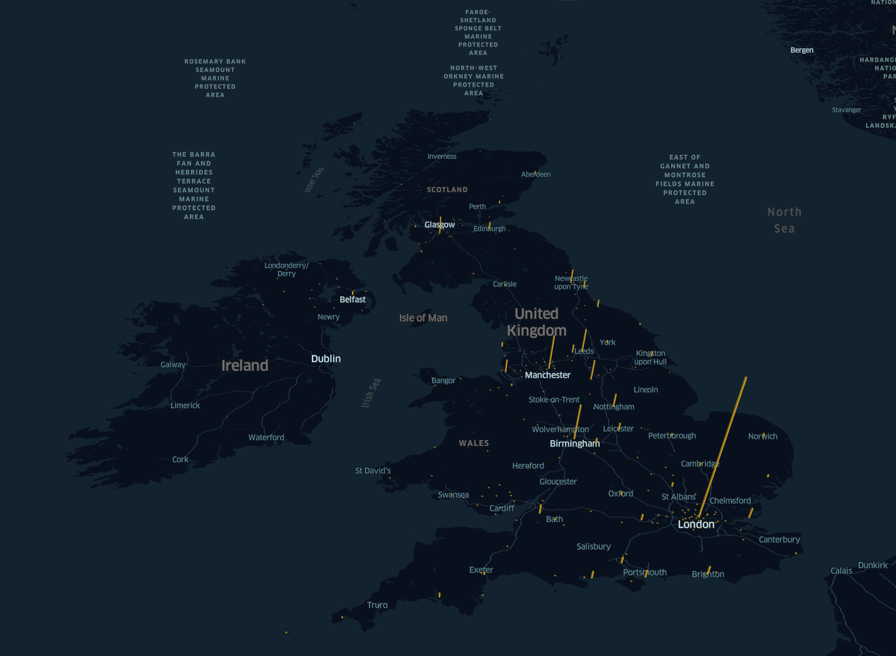

# Overview
This project provides a visualisation of the locations and populations of a number of UK towns and cities. The web app uses [kepler.gl](https://kepler.gl/) to render the map and an API based on the [Django REST framework](https://www.django-rest-framework.org/) serves the initial data and configuration.

The UK cities dataset used has been sourced from https://simplemaps.com/data/gb-cities where it has been released under the MIT license.

## Dependencies
This project requires both Docker and Docker Compose to be installed.

Kepler.gl requires a [Mapbox access token](https://docs.mapbox.com/help/glossary/access-token/).

## Build and run
`export REACT_APP_MAPBOX_TOKEN=<your_mapbox_token>`

`docker-compose up --build`

Once the containers are running the web app can be accessed at http://localhost:8080 in your web browser.

The API endpoint which provides the initial state and data for the app is http://localhost:8081/api/data.

## Screenshot

